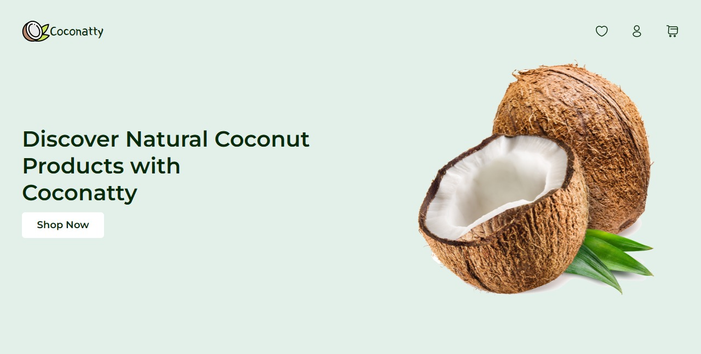

# Coconatty - E-commerce Coconut Store Landing Page

Welcome to the Coconatty GitHub repository! Coconatty is an enticing landing page for an e-commerce coconut store, offering a refreshing and immersive shopping experience. The landing page was built with React, Tailwind CSS, and Framer Motion to create a seamless and captivating user interface.

## Live Site

Discover the live Coconatty landing page [here](https://coconatty.vercel.app/).

## Features

- Visually appealing design showcasing the variety of coconut products.
- Smooth animations with Framer Motion, making the browsing experience delightful.
- Responsive layout with Tailwind CSS, ensuring compatibility with all devices.
